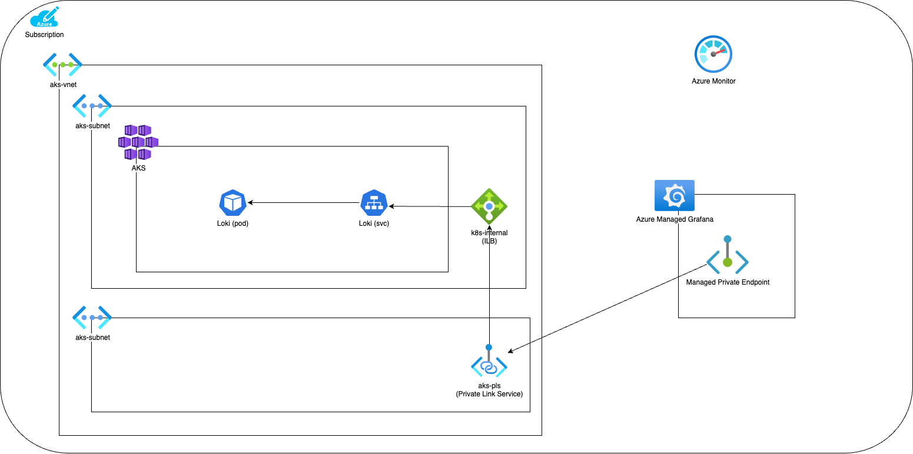

# AKS with Azure Managed Grafana and Loki using Private Endpoints

With the proliferation of cloud providers offering managed services around Open Source offerings, it’s no surprise that there would be demand for managed and secure implementations of Kubernetes, Grafana and Loki.

At this time, Azure offers a managed Kubernetes (AKS) and Grafana (Azure Managed Grafana), but not Loki.  To best architect this, we want to secure this by not publicly exposing the Loki instance and using a Managed Endpoint.

There’s good documentation around this on the Microsoft Learn docs; however, one caveat which may throw some people off is that the Private Endpoint must be in a different subnet than the Load Balancer.  See Restrictions in [Azure Private Link Service Integration - Cloud Provider Azure](https://cloud-provider-azure.sigs.k8s.io/topics/pls-integration/).

These steps can be walked through to create your own instance of this architecture:



```bash
PREFIX="tmfgps"
LOCATION="southcentralus"
RESOURCE_GROUP="${PREFIX}-aks-rg"

VNET_NAME="${PREFIX}-vnet"
VNET_AKS_SUBNET_NAME="aks-subnet"
VNET_PLS_SUBNET_NAME="pls-subnet"

AKS_NAME="${PREFIX}-aks"
AKS_NODEPOOL_NAME="${PREFIX}-nodepool-rg"
AKS_INTERNAL_LB_NAME="kubernetes-internal"

# Create resource group
az group create --name $RESOURCE_GROUP --location $LOCATION

# Create Vnet + subnet
az network vnet create --resource-group $RESOURCE_GROUP --name $VNET_NAME --address-prefixes 10.114.0.0/16
az network vnet subnet create --resource-group $RESOURCE_GROUP --vnet-name $VNET_NAME --name $VNET_AKS_SUBNET_NAME --address-prefixes 10.114.2.0/23
az network vnet subnet create --resource-group $RESOURCE_GROUP --vnet-name $VNET_NAME --name $VNET_PLS_SUBNET_NAME --address-prefixes 10.114.4.0/24
VNET_AKS_SUBNET_ID=$(az network vnet subnet show --resource-group $RESOURCE_GROUP --vnet-name $VNET_NAME --name $VNET_AKS_SUBNET_NAME --query id -o tsv)
echo $VNET_AKS_SUBNET_ID

# Create Log Analytics
az monitor log-analytics workspace create --resource-group $RESOURCE_GROUP --workspace-name $AKS_NAME --location $LOCATION

# Create Prometheus
az resource create \
    --resource-group $RESOURCE_GROUP \
    --namespace microsoft.monitor \
    --resource-type accounts \
    --name "${PREFIX}-monitor" \
    --location $LOCATION \
    --properties '{}'

# Create Azure Managed Grafana
az grafana create \
    --name "${PREFIX}-grafana" \
    --resource-group $RESOURCE_GROUP

GRAFANA_WORKSPACE=${PREFIX}-grafana
GRAFANA_ID=$(az grafana show \
    --name $GRAFANA_WORKSPACE \
    --resource-group $RESOURCE_GROUP \
    --query id \
    --output tsv)
echo $GRAFANA_ID

# Assign the Grafana Admin role to the current user
CURRENT_USER=$(az ad signed-in-user show --query id -o tsv)
az role assignment create \
    --assignee $CURRENT_USER \
    --role 22926164-76b3-42b3-bc55-97df8dab3e41 \
    --scope $GRAFANA_ID

AZURE_MONITOR_ID=$(az resource show \
    --resource-group $RESOURCE_GROUP \
    --name "${PREFIX}-monitor" \
    --resource-type "Microsoft.Monitor/accounts" \
    --query id \
    --output tsv)
echo $AZURE_MONITOR_ID

# Create AKS cluster
az aks create -g $RESOURCE_GROUP -n $AKS_NAME -l $LOCATION \
    --node-count 3 \
    --node-vm-size Standard_B4as_v2 \
    --node-resource-group $AKS_NODEPOOL_NAME \
    --enable-addons monitoring \
    --enable-azure-monitor-metrics \
    --pod-cidr 192.168.0.0/16 \
    --network-plugin azure \
    --network-plugin-mode overlay \
    --vnet-subnet-id $VNET_AKS_SUBNET_ID \
    --azure-monitor-workspace-resource-id $AZURE_MONITOR_ID \
    --grafana-resource-id $GRAFANA_ID \
    --no-ssh-key

az aks get-credentials --resource-group $RESOURCE_GROUP --name $AKS_NAME --admin --overwrite-existing

## Install Loki
# https://grafana.com/docs/loki/latest/setup/install/helm/install-monolithic/

helm repo add grafana https://grafana.github.io/helm-charts

helm repo update

cat > values.yaml <<EOF
deploymentMode: SingleBinary
loki:
  auth_enabled: false
  commonConfig:
    replication_factor: 1
  storage:
    type: 'filesystem'
  schemaConfig:
    configs:
    - from: "2024-01-01"
      store: tsdb
      index:
        prefix: loki_index_
        period: 24h
      object_store: filesystem # we're storing on filesystem so there's no real persistence here.
      schema: v13
singleBinary:
  replicas: 1
read:
  replicas: 0
backend:
  replicas: 0
write:
  replicas: 0
gateway:
  service:
    type: LoadBalancer
    annotations:
      service.beta.kubernetes.io/azure-load-balancer-internal: "true"
EOF

# As of 7/24/22, stable is not stable: https://github.com/grafana/loki/issues/13633 Using last known "good" version
helm install --values values.yaml loki --create-namespace --namespace=loki grafana/loki --version 6.6.6

# Create the Private link service for the Loki service
AKS_INTERNAL_LB_FE_CONFIG=$(az network lb rule list -g $AKS_NODEPOOL_NAME --lb-name=$AKS_INTERNAL_LB_NAME -o json | jq -r '.[0].frontendIPConfiguration.id')
echo $AKS_INTERNAL_LB_FE_CONFIG

PLS_NAME=aks-internal-lb-pls

# https://learn.microsoft.com/en-us/azure/private-link/disable-private-link-service-network-policy?tabs=private-link-network-policy-cli
az network vnet subnet update --name $VNET_AKS_SUBNET_NAME --vnet-name $VNET_NAME --resource-group $RESOURCE_GROUP --private-link-service-network-policies Disabled

az network private-link-service create \
    --resource-group $RESOURCE_GROUP \
    --name $PLS_NAME \
    --vnet-name $VNET_NAME \
    --subnet $VNET_AKS_SUBNET_NAME \
    --lb-name $AKS_INTERNAL_LB_NAME \
    --lb-frontend-ip-configs $AKS_INTERNAL_LB_FE_CONFIG

PLS_ID=$(az network private-link-service show \
    --name $PLS_NAME \
    --resource-group $RESOURCE_GROUP \
    --query id \
    --output tsv)
echo $PLS_ID

# Create the Managed Private Endpoint inside Grafana for the Loki service
MANAGED_PRIVATE_ENDPOINT_NAME=grafana-mpe
az rest --method put --url
https://management.azure.com/subscriptions/${SUBSCRIPTION_ID}/resourceGroups/${RESOURCE_GROUP}/providers/Microsoft.Dashboard/grafana/${GRAFANA_NAME}/managedPrivateEndpoints/${MANAGED_PRIVATE_ENDPOINT_NAME}?api-version=2023-09-01
--body "{'location': '${LOCATION}', 'properties': {'privateLinkResourceId': '${PLS_ID}'}}"
# OR perform the following in the portal: Perform steps 1-4:
# https://learn.microsoft.com/en-us/azure/managed-grafana/how-to-connect-to-data-source-privately#create-a-managed-private-endpoint-to-azure-private-link-service
# Setup a Managed Private Endpoint from Azure Managed Prometheus to the Internal Loadbalancer of the AKS cluster
# Use the $PLS_ID as the target resource ID

# NOTE: This is step 5 from the previous documentation (Approve the private endpoint connection request)
# https://learn.microsoft.com/en-us/azure/private-link/manage-private-endpoint?tabs=manage-private-link-cli#manage-private-endpoint-connections-on-a-customer--or-partner-owned-private-link-service
az network private-endpoint-connection list -g $RESOURCE_GROUP --type Microsoft.Network/privateLinkServices -n $PLS_NAME
# Verify there is just the one we added
PE_CONNECTION_ID=$(az network private-endpoint-connection list -g $RESOURCE_GROUP --type Microsoft.Network/privateLinkServices -n $PLS_NAME -o json | jq -r '.[0].id')
echo $PE_CONNECTION_ID

# Approve the private endpoint
az network private-endpoint-connection approve --id $PE_CONNECTION_ID

# Should see one
az network private-endpoint-connection approve -g $RESOURCE_GROUP --type Microsoft.Network/privateLinkServices -n $PLS_NAME

# NOTE: MUST BE PERFORMED IN THE PORTAL.  Perform step 6: (Go into portal and hit refresh)
# https://learn.microsoft.com/en-us/azure/managed-grafana/how-to-connect-to-data-source-privately#create-a-managed-private-endpoint-to-azure-private-link-service
# Use the IP from Azure Managed Grafana -> Settings -> Networking -> Managed Private Endpoint -> "click the ..." -> "Private Link Service private IP" 
GRAFANA_DASHBOARD=$(az grafana show --name "${PREFIX}-grafana" --resource-group $RESOURCE_GROUP | jq -r '.properties.endpoint')
echo $GRAFANA_DASHBOARD

# NOTE: THIS MUST BE PERFORMED IN THE GRAFANA DASHBOARD
# Add the Loki datasource to Grafana
# Click "Data Sources" -> "Add data source" -> "Loki" 
# Values: "URL" -> "http://<insert value from Private Link Service private IP>" 
# Under "HTTP Headers" click "Add header":  Header: 'X-Scope-OrgID' Value: 'test'
# Click "Save & Test"
```