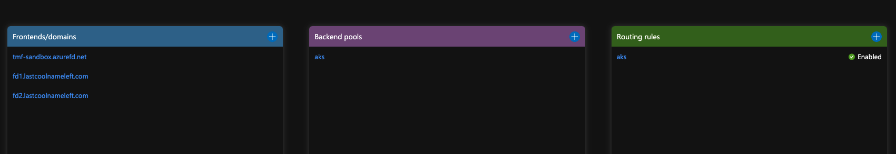
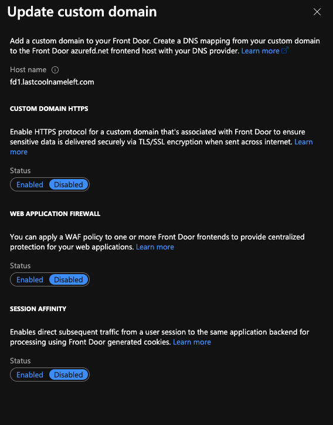
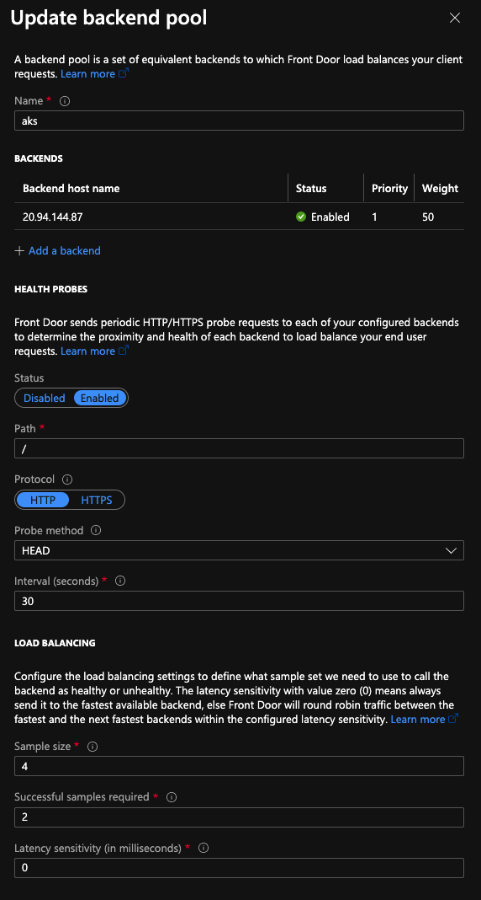
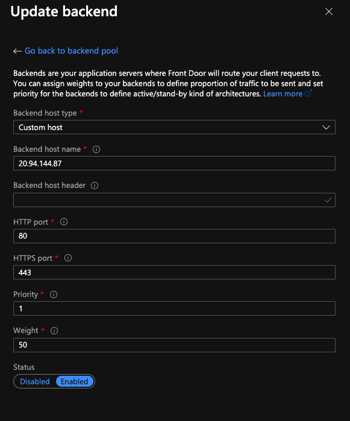
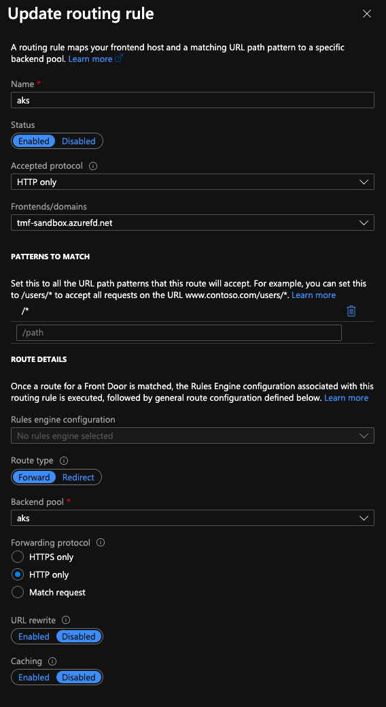

#  The easiest way is to install the Helm charts for each

```shell
INGRESS_IP=$(kgsvc -n ingress-basic nginx-ingress-ingress-nginx-controller -o json | jq '.status.loadBalancer.ingress[0].ip' -r)

CUSTOM_DOMAIN=lastcoolnameleft.com
FRONT_DOOR_NAME=tmf-sandbox
# Create 1st namespace + ingress + deployment
NAME1=fd1
kubectl create namespace $NAME1
kubens $NAME1

helm upgrade --install --wait $NAME1 podinfo/podinfo \
    --set ui.message=$NAME1.$CUSTOM_DOMAIN \
    --set ingress.enabled=true \
    --set logLevel=debug \
    --set "ingress.hosts[0]=$NAME1.$CUSTOM_DOMAIN" \
    --set ingress.path='/'

# Now create 2nd namespace + ingress + deployment
NAME22=fd2
kubectl create namespace $NAME2
kubens $NAME2

helm upgrade --install --wait $NAME2 podinfo/podinfo \
    --set ui.message=$NAME2.$CUSTOM_DOMAIN \
    --set ingress.enabled=true \
    --set logLevel=debug \
    --set "ingress.hosts[0]=$NAME2.$CUSTOM_DOMAIN" \
    --set ingress.path='/'
```

## Validate Backend Ingress Route is setup

```
curl -H "Host: $FRONT_DOOR_NAME.azurefd.net" http://$INGRESS_IP
curl -H "Host: $NAME1.$CUSTOM_DOMAIN" http://$INGRESS_IP
curl -H "Host: $NAME2.$CUSTOM_DOMAIN" http://$INGRESS_IP
```

## Setup Front Door








## Cleanup
```
kubectl delete namespace fd1
kubectl delete namespace fd2
```
