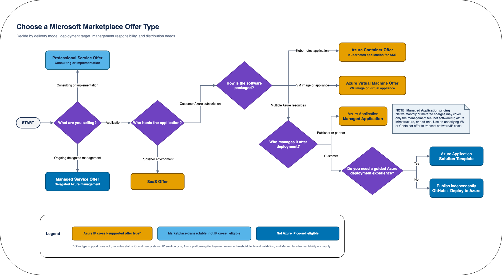

# Azure IP Co-sell Reference Architecture

[Azure IP co-sell eligible status](https://learn.microsoft.com/en-us/partner-center/referrals/co-sell-overview), is a common goal for many software development companies (SDC) partnering with Microsoft, as it allows end customers to [decrement their Microsoft Azure consumption](https://learn.microsoft.com/en-us/marketplace/azure-consumption-commitment-benefit) costs at 100% when using the partner's solution.

## Requirements

There are 4 [requirements](https://learn.microsoft.com/en-us/partner-center/referrals/co-sell-requirements#requirements-for-azure-ip-co-sell-eligible-status) to achieve Azure IP co-sell eligible status:

* Reach the required revenue threshold ($100K of Azure usage or sales through the Microsoft Marketplace over 12 months)
* Meets the [Azure IP co-sell technical validation requirements](https://learn.microsoft.com/en-us/partner-center/referrals/co-sell-requirements#technical-validation)
* [Provide a reference architecture diagram](https://learn.microsoft.com/en-us/partner-center/referrals/reference-architecture-diagram)
* Offer is transactable on Microsoft Marketplace

For a SaaS solution to pass technical validation, it must be "primarily platformed on Azure." This is detailed in the [Marketplace Terms and Conditions for SaaS offers](https://learn.microsoft.com/en-us/legal/marketplace/certification-policies#1000-software-as-a-service-saas).

## Marketplace Offer Decision Chart

Use this chart to identify the Microsoft Marketplace offer type that best fits
your delivery model, deployment target, and management responsibilities. The
legend distinguishes Azure IP co-sell-supported offer types from other
Marketplace and independent deployment options.

To adapt the chart, [download the editable Draw.io source](decision-chart.drawio).

## Example Architecture

Many SDC's share similar architectural patterns, so this example is meant to give you a solid starting point. It's built with [Draw.io](https://draw.io/).

This example models a SaaS architecture where a customer (also on Azure) connects to the SDC's API via Private Endpoint.

**Components included:**

* **SDC Subscription**
    * AKS
        * Ingress Controller
        * App pod (IP)
        * Data pod (IP)
    * Azure Load Balancer
    * CosmosDB
    * Storage Account
    * Azure Key Vault
* **Customer Subscription**

To use this as a starting point, [download the Draw.io source file](sample-reference-architecture.drawio) and modify it to reflect your own architecture.

Important considerations:
* __Clearly__ show what's in the your Azure subscription and what's outside (e.g. use boxes to easily indicate).
* __List__ each of the Azure Services your solution uses.
* Use __red boxes with white bold text__ to showcase exactly where your Intellectual Property (IP) resides
* Provide a __detailed, numbered flow__ of the data with the user interfaces and other services