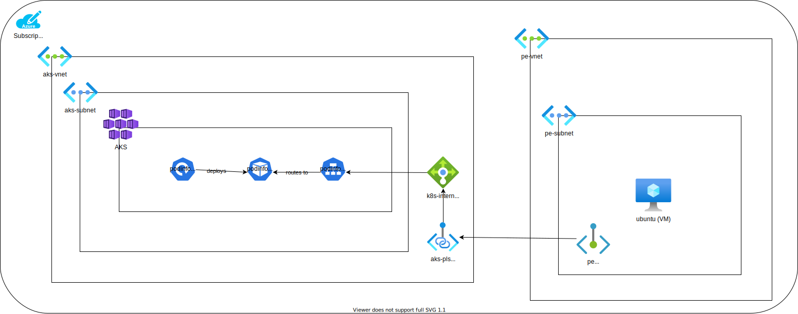

# AKS + Private Link Service

This walkthrough shows how to setup a Private Link Service with an AKS cluster and create a Private Endpoint in a separate Vnet.

While many tutorials might give you a full ARM template, this is designed as a walkthrough which completely uses the CLI so you can understand what's happening at every step of the process.

It focuses on an "uninteresting" workload and uses [podinfo](https://github.com/stefanprodan/podinfo) as the sample app.  This is because it's easy to deploy and customize with a sample Helm chart.

This is inspired and leans heavily on the Azure Docs for [creating a Private Link Service](https://docs.microsoft.com/en-us/azure/private-link/create-private-link-service-cli).

## Architecture



## Prerequisites

* [Azure CLI](https://docs.microsoft.com/en-us/cli/azure/)
* [jq](https://stedolan.github.io/jq/)

## Assumptions

This walkthrough assumes you let Azure create the Vnet when creating the AKS cluster.  If you manually created the Vnet, then the general steps are the same, except you must enter the AKS_MC_VNET, AKS_MC_SUBNET env vars manually.


## Setup Steps

First, create a sample AKS cluster and install Podinfo on it.

```
# Set these values
AKS_NAME=
AKS_RG=
LOCATION=

# Create the AKS cluster
az aks create -n $AKS_NAME -g $AKS_RG

# Get the MC Resource Group
AKS_MC_RG=$(az aks show -n $AKS_NAME -g $AKS_RG | jq -r '.nodeResourceGroup')
echo $AKS_MC_RG

# Get the Vnet Name
AKS_MC_VNET=$(az network vnet list -g $AKS_MC_RG | jq -r '.[0].name')
echo $AKS_MC_VNET

AKS_MC_SUBNET=$(az network vnet subnet list -g $AKS_MC_RG --vnet-name $AKS_MC_VNET | jq -r '.[0].name')
echo $AKS_MC_SUBNET

AKS_MC_LB_INTERNAL=kubernetes-internal

AKS_MC_LB_INTERNAL_FE_CONFIG=$(az network lb rule list -g $AKS_MC_RG --lb-name=$AKS_MC_LB_INTERNAL | jq -r '.[0].frontendIpConfiguration.id')
echo $AKS_MC_LB_INTERNAL_FE_CONFIG

# Deploy a sample app using an Internal LB
helm upgrade --install --wait podinfo-internal-lb \
    --set-string service.annotations."service\.beta\.kubernetes\.io\/azure-load-balancer-internal"=true \
    --set service.type=LoadBalancer \
    --set ui.message=podinfo-internal-lb \
    podinfo/podinfo
```

## Install Steps - Create the Private Link Service

These steps will be done in the MC_ resource group.

```
# Disable the private link service network policies
az network vnet subnet update \
    --name $AKS_MC_SUBNET \
    --resource-group $AKS_MC_RG \
    --vnet-name $AKS_MC_VNET \
    --disable-private-link-service-network-policies true


# Create the PLS
PLS_NAME=aks-pls
az network private-link-service create \
    --resource-group $AKS_MC_RG \
    --name $PLS_NAME \
    --vnet-name $AKS_MC_VNET \
    --subnet $AKS_MC_SUBNET \
    --lb-name $AKS_MC_LB_INTERNAL \
    --lb-frontend-ip-configs $AKS_MC_LB_INTERNAL_FE_CONFIG
```


## Install Steps - Create the Private Endpoint

These steps will be done in our `private-endpoint-rg` resource group.

```
PE_RG=private-endpoint-rg
az group create \
    --name $PE_RG \
    --location $LOCATION

PE_VNET=pe-vnet
PE_SUBNET=pe-subnet

az network vnet create \
    --resource-group $PE_RG \
    --name $PE_VNET \
    --address-prefixes 10.0.0.0/16 \
    --subnet-name $PE_SUBNET \
    --subnet-prefixes 10.0.0.0/24

# Disable the private link service network policies
az network vnet subnet update \
    --name $PE_SUBNET \
    --resource-group $PE_RG \
    --vnet-name $PE_VNET \
    --disable-private-endpoint-network-policies true


PE_CONN_NAME=pe-conn
PE_NAME=pe
az network private-endpoint create \
    --connection-name $PE_CONN_NAME \
    --name $PE_NAME \
    --private-connection-resource-id $PLS_ID \
    --resource-group $PE_RG \
    --subnet $PE_SUBNET \
    --manual-request false \
    --vnet-name $PE_VNET

# We need the NIC ID to get the newly created Private IP
PE_NIC_ID=$(az network private-endpoint show -g $PE_RG --name $PE_NAME -o json | jq -r '.networkInterfaces[0].id')
echo $PE_NIC_ID

# Get the Private IP from the NIC
PE_IP=$(az network nic show --ids $PE_NIC_ID -o json | jq -r '.ipConfigurations[0].privateIpAddress')
echo $PE_IP

```

## Validation Steps - Create a VM

Lastly, validate that this works by creating a VM in the Vnet with the Private Endpoint.

```
VM_NAME=ubuntu
az vm create \
    --resource-group $PE_RG \
    --name ubuntu \
    --image UbuntuLTS \
    --public-ip-sku Standard \
    --vnet-name $PE_VNET \
    --subnet $PE_SUBNET \
    --admin-username $USER \
    --ssh-key-values ~/.ssh/id_rsa.pub

VM_PIP=$(az vm list-ip-addresses -g $PE_RG -n $VM_NAME | jq -r '.[0].virtualMachine.network.publicIpAddresses[0].ipAddress')
echo $VM_PIP

# SSH into the host
ssh $VM_IP

$ curl <Copy the value from $PE_IP>:9898

# The output should look like:
$ curl 10.0.0.5:9898
{
  "hostname": "podinfo-6ff68cbf88-cxcvv",
  "version": "6.0.3",
  "revision": "",
  "color": "#34577c",
  "logo": "https://raw.githubusercontent.com/stefanprodan/podinfo/gh-pages/cuddle_clap.gif",
  "message": "podinfo-internal-lb",
  "goos": "linux",
  "goarch": "amd64",
  "runtime": "go1.16.9",
  "num_goroutine": "9",
  "num_cpu": "2"
}
```


## Multiple PLS/PE

To test a specific use case, I wanted to create multiple PLS and PE's.  This set of instructions lets you easily loop through and create multiple instances.

```
# podinfo requires a high numbered port, eg 9000+

SUFFIX=9000
helm upgrade --install --wait podinfo-$SUFFIX \
    --set-string service.annotations."service\.beta\.kubernetes\.io\/azure-load-balancer-internal"=true \
    --set service.type=LoadBalancer \
    --set service.httpPort=$SUFFIX \
    --set service.externalPort=$SUFFIX \
    --set ui.message=podinfo-$SUFFIX \
    podinfo/podinfo

# This might be easier to hard-code
AKS_MC_LB_INTERNAL_FE_CONFIG=$(az network lb rule list -g $AKS_MC_RG --lb-name=$AKS_MC_LB_INTERNAL -o json | jq -r ".[] | select( .backendPort == $SUFFIX) | .frontendIpConfiguration.id")
echo $AKS_MC_LB_INTERNAL_FE_CONFIG

PLS_NAME=aks-pls-$SUFFIX
PE_CONN_NAME=pe-conn-$SUFFIX
PE_NAME=pe-$SUFFIX

az network private-link-service create \
    --resource-group $AKS_MC_RG \
    --name $PLS_NAME \
    --vnet-name $AKS_MC_VNET \
    --subnet $AKS_MC_SUBNET \
    --lb-name $AKS_MC_LB_INTERNAL \
    --lb-frontend-ip-configs $AKS_MC_LB_INTERNAL_FE_CONFIG

PLS_ID=$(az network private-link-service show \
    --name $PLS_NAME \
    --resource-group $AKS_MC_RG \
    --query id \
    --output tsv)
echo $PLS_ID

az network private-endpoint create \
    --connection-name $PE_CONN_NAME \
    --name $PE_NAME \
    --private-connection-resource-id $PLS_ID \
    --resource-group $PE_RG \
    --subnet $PE_SUBNET \
    --manual-request false \
    --vnet-name $PE_VNET

PE_NIC_ID=$(az network private-endpoint show -g $PE_RG --name $PE_NAME -o json | jq -r '.networkInterfaces[0].id')
echo $PE_NIC_ID

PE_IP=$(az network nic show --ids $PE_NIC_ID -o json | jq -r '.ipConfigurations[0].privateIpAddress')
echo $PE_IP

echo "From your Private Endpoint VM run: curl $PE_IP:$SUFFIX"
```


## Untested Content

# Create the Private DNS Zone

At this time, I don't think you can use Private DNS Zone with a service backed by PLS

```
PRIVATE_DNS_ZONE_NAME="privatelink.lastcoolnameleft.net"
az network private-dns zone create \
    --resource-group $PE_RG \
    --name $PRIVATE_DNS_ZONE_NAME

DNS_LINK=pe-dns-link
az network private-dns link vnet create \
    --resource-group $PE_RG \
    --zone-name "$PRIVATE_DNS_ZONE_NAME" \
    --name $DNS_LINK \
    --virtual-network $PE_VNET \
    --registration-enabled false

DNS_ZONE_GROUP=pe-dns-zone-group
PE_DNS_ZONE_NAME=aks-zone
az network private-endpoint dns-zone-group create \
    --resource-group $PE_RG \
    --endpoint-name $PE_NAME \
    --name $DNS_ZONE_GROUP \
    --private-dns-zone "$PRIVATE_DNS_ZONE_NAME" \
    --zone-name $PE_DNS_ZONE_NAME
```